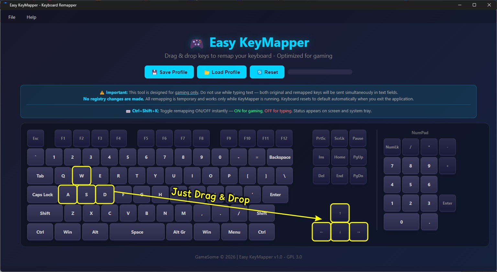

# Easy Keymapper

**Drag & drop keyboard remapper optimized for gaming.**  
No registry changes. No driver installation. Just run and play.

## Features

- **Drag & Drop Interface** : Visually swap keys by dragging and dropping
- **Gaming Optimized** : Remap WASD, arrow keys, action keys, and more
- **Profile System** : Save and load different mappings for each game
- **Instant Toggle** : `Ctrl+Shift+K` to switch ON/OFF on the fly
- **Auto-Reset** : Keyboard returns to default when you close the app
- **No Registry Changes** : All remapping is temporary and safe

## Quick Start

- Drag a key onto another key to swap them
- Turn ON/OFF in the game press `Ctrl+Shift+K` for text input.
- Close the app to reset keyboard to default

##  How to Use

| Situation | Action | Status |
|-----------|--------|--------|
| Entering a game | `Ctrl+Shift+K` → ON | 🟢 Gaming Mode |
| Typing in chat | `Ctrl+Shift+K` → OFF | 🔴 Typing Mode |
| Switch profiles | File → Load Profile | 💾 Saved Mappings |
| Reset all keys | File → Reset | 🔄 Default |

## Important: Dual Key Signal

**This tool is designed for gaming, not for typing text.**

When remapping is ACTIVE:
- In **games** (DirectInput/XInput): ✅ Works perfectly, no issues
- In **text editors** (In-game text input, Notepad, browsers, etc): Both the original key AND the remapped key are sent simultaneously

**Why?**  
Windows sends keyboard signals at the OS level. `Easy Keymapper` listens for key presses and sends the remapped key, but cannot block the original key without a kernel-level driver. Games typically use DirectInput which ignores WM_KEY messages, so this is not an issue during gameplay.

**Solution:**  
Toggle remapping ON before gaming, OFF when typing. Use `Ctrl+Shift+K` to switch instantly. You can also make this transition on the game screen. Easy Keymapper detects this in the background.

## Tech Stack

- **Frontend:** HTML5, CSS3, JavaScript (Drag & Drop API)
- **Backend:** Node.js, Electron
- **Key Hooking:** uiohook-napi
- **Key Sending:** robotjs

## 📸 Screenshots

